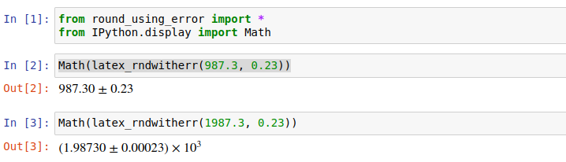

[Introduction](#introduction) | [Install](#install-using-pip) | 
[Default Usage](#default-usage) | 
[Adjusting # of Significant Figures on Error](#adjusting-significant-figures-on-error)
 | [Render Latex in Jupyter](#render-latex-in-jupyter)
# Round Using Error
### Introduction
This package provides opinionated tools for formatting the output of values 
with known errors. The general format is `value +/- error`. The values are 
rounded so that the last digit reported for the value is the same order of 
magnitude as the least significant digit reported on the error. The default 
is to report the error to two significant figures. The opinionated 
part is that the output switches automatically from decimal to scientific 
notation. Scientific notation is used for values < 0.1 and > 1000.

The output is available as:
* tuple of strings (value, error, power_of_ten);
* text in format `value +/- error`;
* latex in the form `value \pm error`.
### Usage
#### Install using pip
`pip install -U round_using_error`. **not yet on pypi.org**
#### Default usage:
```
>>> from round_using_error import *
>>> rndwitherr(0.001234, 0.000241)
('1.23', '0.24', '-3')
>>> rndwitherr(1299.845, 0.124)
('1.29985', '0.00012', '3')
>>> text_rndwitherr(1299.845, 0.124)
'(1.29985 +/- 0.00012) X 10^3'
>>> latex_rndwitherr(1299.845, 0.124)
'(1.29985\\pm0.00012)\\times 10^3'
>>> rndwitherr(0.001234, 0.000241)
('1.23', '0.24', '-3')
>>> text_rndwitherr(0.001234, 0.000241)
'(1.23 +/- 0.24) X 10^-3'
>>> latex_rndwitherr(0.001234, 0.000241)
'(1.23\\pm0.24)\\times 10^-3'
>>> rndwitherr(0.1234, 0.024)
('0.123', '0.024', '')
>>> text_rndwitherr(0.1234, 0.024)
'0.123 +/- 0.024'
>>> latex_rndwitherr(0.1234, 0.024)
'0.123\\pm0.024'
```
#### Adjusting significant figures on error
```
>>> from round_using_error import *
>>> latex_rndwitherr(0.1234, 0.024)
'0.123\\pm0.024'
>>> rndwitherr(0.001234, 0.000241, errdig = 1)
('1.2', '0.2', '-3')
>>> rndwitherr(0.001234, 0.000241, errdig = 3)
('1.234', '0.241', '-3')
>>> text_rndwitherr(0.001234, 0.000241, errdig = 3)
'(1.234 +/- 0.241) X 10^-3'
>>> latex_rndwitherr(0.001234, 0.000241, errdig = 3)
'(1.234\\pm0.241)\\times 10^-3'
```
#### Render Latex in Jupyter
